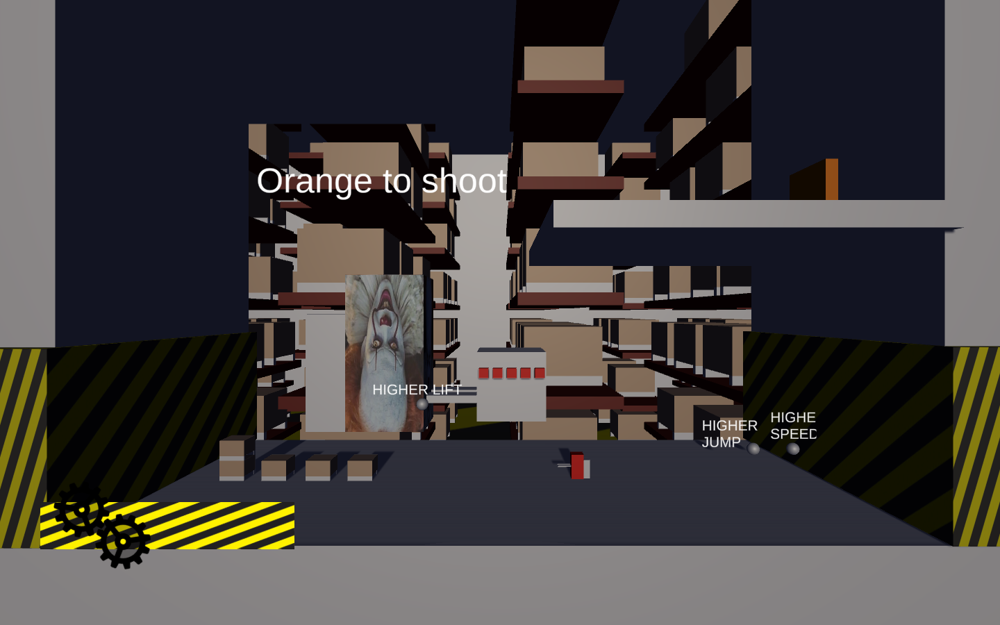
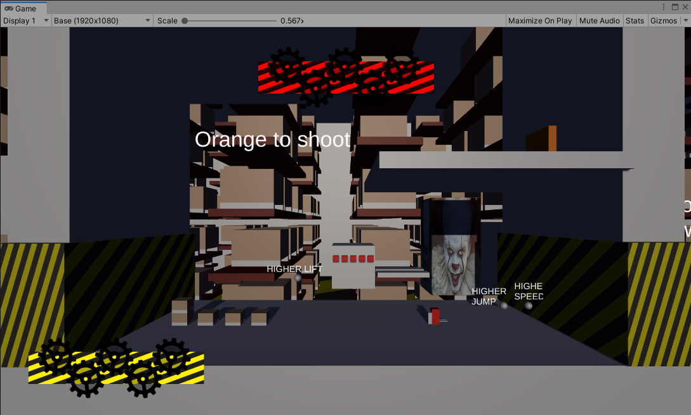

# Platformer2D
###### Jarod Sengkeo

## Presentation
This project is a 2D platformer where the player plays as a fork lift. Then the player can play arround with boxes placed on the map, climb walls with them and shoot enemies. The platformer is in a storehouse, so platforms may look like lifts or boxes.

## Controls
| Key | description |
| -- | -- |
| A, D, Arrow Keys | move the player |
| W, S, Arrow Keys | move the player's lift up and down |
| Space | jump |
| Shift | lock player's rotation |
| F | shoot boxes |
| Escape | pause |
The player has no double jump but can jump in the air (while falling).

## Features
- movable boxes
- shoot boxes
- standard enemy
- lava
- moving platform (vertical)
- collectibles
	- heal
	- bonuses
		- movement boost
		- jump boost
		- lift boost
		- boost cancel
	- the end
- bumpers
- boss and canon
- moving background
- health bar
- menu
	- main menu
	- pause
	- "you win" screen
	- "you lose" screen

## Bugs/Problems
- boss
	- boss' health bar doesn't show in build but shows in Unity

- when game is paused, the player is falling slowly
- enemies sometimes destroys itself when colliding with the player
	- player's trigger is triggered
- enemies are not directly on the ground but slowly falling
- the player can pause in main menu
- obstacles are not paused

## Next features
- smart enemy (follows the player)
- boss
	- spawn enemies
	- spawn obstacles
- stack the boxes (on the lift or with each other)